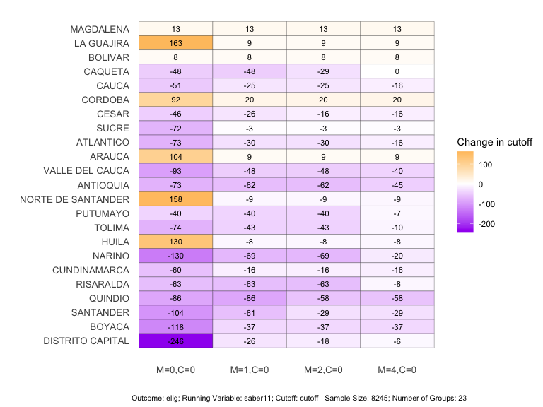

<!-- README.md is generated from README.Rmd. Please edit that file -->

# rdlearn

<!-- badges: start -->
<!-- badges: end -->

- Author: Kentaro Kawato, Zhang Yi
- Reference: Zhang Yi, Eli Ben-Michael, and Kosuke Imai. 2023. “Safe
  Policy Learning under Regression Discontinuity Designs with Multiple
  Cutoffs.” arXiv \[stat.ME\].<http://arxiv.org/abs/2208.13323>.
- Package manual: pdf file

## Introduction

The R package `rdlearn` implements the *safe policy learning under
regression discontinuity designs with multiple cutoffs* of Zhang et
al. (2022). It provides functionality to learn treatment assignment
rules (cutoffs) which are guaranteed to yield no worse overall outcomes
than the existing cutoffs.

## Installation

The `rdlearn` package for R can be downloaded using (requires previous
installation of the [`remotes`
package](https://remotes.r-lib.org/index.html)).

``` r
remotes::install_github("kkawato/rdlearn")
```

Load the package after completed installation.

``` r
library(rdlearn)
```

## Data

For our case study, we download the `acces` dataset and apply the
proposed methodology to the ACCES (Access with Quality to Higher
Education) program, a national-level subsidized loan initiative in
Colombia.

The `acces` data set includes four columns. The `elig` column contains
*outcome* (eligibility for the ACCES program (1: eligible; 0: not
eligible). The `saber11` column contains *running variable* (position
scores from the SABER 11 exam). The `cutoff` column contains the
eligibility *cutoff* for each department, and the `department` column
contains the names of the departments.

``` r
library(rdlearn)

# Load acces data
data(acces)
head(acces)
```

    ## # A tibble: 6 × 4
    ##    elig saber11 cutoff department
    ##   <dbl>   <dbl>  <dbl> <chr>     
    ## 1     1      -2   -729 ANTIOQUIA 
    ## 2     1      -5   -729 ANTIOQUIA 
    ## 3     1     -11   -729 ANTIOQUIA 
    ## 4     1     -12   -729 ANTIOQUIA 
    ## 5     1     -14   -729 ANTIOQUIA 
    ## 6     1     -15   -729 ANTIOQUIA

## Main Analysis: Cutoff change relative to the baseline for each department under different smoothness multiplicative factors

First, we demonstrate how to output a *summary of the data set*, which
includes treatment effect estimates (such as Table 1 in Zhang et
al. (2022)). This can be done as follows:

``` r
rdestimate_result <- rdestimate(y = "elig", x = "saber11", c = "cutoff", group_name = "department", data = acces)
print(rdestimate_result)
```

    ##                 Group Sample_size Baseline_cutoff RD_Estimate   se p_value
    ## 1           MAGDALENA         214            -828        0.55 0.41   0.177
    ## 2          LA GUAJIRA         209            -824        0.57 0.31   0.062
    ## 3             BOLIVAR         646            -786        0.00 0.21   0.982
    ## 4             CAQUETA         238            -779        0.56 0.35   0.107
    ## 5               CAUCA         322            -774        0.02 0.78   0.977
    ## 6             CORDOBA         500            -764       -0.63 0.26   0.014
    ## 7               CESAR         211            -758        0.53 0.37   0.160
    ## 8               SUCRE         469            -755        0.21 0.11   0.049
    ## 9           ATLANTICO         448            -754        0.81 0.15   0.000
    ## 10             ARAUCA         214            -753       -0.70 1.11   0.526
    ## 11    VALLE DEL CAUCA         454            -732        0.61 0.16   0.000
    ## 12          ANTIOQUIA         416            -729        0.70 0.21   0.001
    ## 13 NORTE DE SANTANDER         233            -723       -0.08 0.43   0.858
    ## 14           PUTUMAYO         236            -719       -0.47 0.79   0.556
    ## 15             TOLIMA         347            -716        0.12 0.31   0.687
    ## 16              HUILA         406            -695        0.06 0.23   0.797
    ## 17             NARINO         463            -678        0.08 0.19   0.677
    ## 18       CUNDINAMARCA         403            -676        0.12 0.81   0.882
    ## 19          RISARALDA         263            -672        0.41 0.42   0.330
    ## 20            QUINDIO         215            -660       -0.03 0.11   0.824
    ## 21          SANTANDER         437            -632        0.74 0.25   0.003
    ## 22             BOYACA         362            -618        0.48 0.36   0.187
    ## 23   DISTRITO CAPITAL         539            -559        0.66 0.14   0.000

This provides basic information, including the sample size and baseline
cutoff for each group, as well as the RD treatment effect and standard
error. RD treatment effects marked with an asterisk (\*) are significant
at the 5% level.

Next, we show how to obtain the safe cutoffs by the proposed algorithm.
This can be done as follows:

``` r
set.seed(12345)

rdlearn_result <- rdlearn(data = acces, y = "elig", x = "saber11", c = "cutoff", group_name = "department", fold = 20, M = c(0, 1, 2, 4), cost = 0, trace = FALSE)

summary(rdlearn_result)
```

    ## 

    ## ── Basic Information ───────────────────────────────────────────────────────────

    ##                 Group Sample_size Baseline_cutoff RD_Estimate   se p_value
    ## 1           MAGDALENA         214            -828        0.55 0.41   0.177
    ## 2          LA GUAJIRA         209            -824        0.57 0.31   0.062
    ## 3             BOLIVAR         646            -786        0.00 0.21   0.982
    ## 4             CAQUETA         238            -779        0.56 0.35   0.107
    ## 5               CAUCA         322            -774        0.02 0.78   0.977
    ## 6             CORDOBA         500            -764       -0.63 0.26   0.014
    ## 7               CESAR         211            -758        0.53 0.37   0.160
    ## 8               SUCRE         469            -755        0.21 0.11   0.049
    ## 9           ATLANTICO         448            -754        0.81 0.15   0.000
    ## 10             ARAUCA         214            -753       -0.70 1.11   0.526
    ## 11    VALLE DEL CAUCA         454            -732        0.61 0.16   0.000
    ## 12          ANTIOQUIA         416            -729        0.70 0.21   0.001
    ## 13 NORTE DE SANTANDER         233            -723       -0.08 0.43   0.858
    ## 14           PUTUMAYO         236            -719       -0.47 0.79   0.556
    ## 15             TOLIMA         347            -716        0.12 0.31   0.687
    ## 16              HUILA         406            -695        0.06 0.23   0.797
    ## 17             NARINO         463            -678        0.08 0.19   0.677
    ## 18       CUNDINAMARCA         403            -676        0.12 0.81   0.882
    ## 19          RISARALDA         263            -672        0.41 0.42   0.330
    ## 20            QUINDIO         215            -660       -0.03 0.11   0.824
    ## 21          SANTANDER         437            -632        0.74 0.25   0.003
    ## 22             BOYACA         362            -618        0.48 0.36   0.187
    ## 23   DISTRITO CAPITAL         539            -559        0.66 0.14   0.000

    ## 

    ## ── Safe Cutoffs and Original Cutoff ────────────────────────────────────────────

    ##                    original M=0,C=0 M=1,C=0 M=2,C=0 M=4,C=0
    ## MAGDALENA              -828    -815    -815    -815    -815
    ## LA GUAJIRA             -824    -661    -815    -815    -815
    ## BOLIVAR                -786    -778    -778    -778    -778
    ## CAQUETA                -779    -827    -827    -808    -779
    ## CAUCA                  -774    -825    -799    -799    -790
    ## CORDOBA                -764    -672    -744    -744    -744
    ## CESAR                  -758    -804    -784    -774    -774
    ## SUCRE                  -755    -827    -758    -758    -758
    ## ATLANTICO              -754    -827    -784    -784    -770
    ## ARAUCA                 -753    -649    -744    -744    -744
    ## VALLE DEL CAUCA        -732    -825    -780    -780    -772
    ## ANTIOQUIA              -729    -802    -791    -791    -774
    ## NORTE DE SANTANDER     -723    -565    -732    -732    -732
    ## PUTUMAYO               -719    -759    -759    -759    -726
    ## TOLIMA                 -716    -790    -759    -759    -726
    ## HUILA                  -695    -565    -703    -703    -703
    ## NARINO                 -678    -808    -747    -747    -698
    ## CUNDINAMARCA           -676    -736    -692    -692    -692
    ## RISARALDA              -672    -735    -735    -735    -680
    ## QUINDIO                -660    -746    -746    -718    -718
    ## SANTANDER              -632    -736    -693    -661    -661
    ## BOYACA                 -618    -736    -655    -655    -655
    ## DISTRITO CAPITAL       -559    -805    -585    -577    -565

    ## 

    ## ── Numerical Difference of Cutoffs ─────────────────────────────────────────────

    ##                    M=0,C=0 M=1,C=0 M=2,C=0 M=4,C=0
    ## MAGDALENA               13      13      13      13
    ## LA GUAJIRA             163       9       9       9
    ## BOLIVAR                  8       8       8       8
    ## CAQUETA                -48     -48     -29       0
    ## CAUCA                  -51     -25     -25     -16
    ## CORDOBA                 92      20      20      20
    ## CESAR                  -46     -26     -16     -16
    ## SUCRE                  -72      -3      -3      -3
    ## ATLANTICO              -73     -30     -30     -16
    ## ARAUCA                 104       9       9       9
    ## VALLE DEL CAUCA        -93     -48     -48     -40
    ## ANTIOQUIA              -73     -62     -62     -45
    ## NORTE DE SANTANDER     158      -9      -9      -9
    ## PUTUMAYO               -40     -40     -40      -7
    ## TOLIMA                 -74     -43     -43     -10
    ## HUILA                  130      -8      -8      -8
    ## NARINO                -130     -69     -69     -20
    ## CUNDINAMARCA           -60     -16     -16     -16
    ## RISARALDA              -63     -63     -63      -8
    ## QUINDIO                -86     -86     -58     -58
    ## SANTANDER             -104     -61     -29     -29
    ## BOYACA                -118     -37     -37     -37
    ## DISTRITO CAPITAL      -246     -26     -18      -6

    ## 

    ## ── Measures of Difference ──────────────────────────────────────────────────────

    ##       M=0,C=0  M=1,C=0  M=2,C=0  M=4,C=0
    ## l1   88.91304 33.00000 28.78261 17.52174
    ## l2  102.92568 40.21626 34.92352 22.67061
    ## max 246.00000 86.00000 69.00000 58.00000

``` r
plot(rdlearn_result, opt = "dif")
```

<!-- -->

This plot is the same as the result of Figure 2 in Zhang et al.(2022),
which shows the cutoff change relative to the baseline for each
department under different smoothness multiplicative factors (`M`).

The main function here is `rdlearn`. The arguments include `data` for
the *data set*, `y` for the *outcome*, `x` for the *running variable*,
`c` for the *cutoff*, and `group_name` for the *group name*. These
arguments specify the data we analyze. The `fold` argument specifies
*the number of folds for cross-fitting*.

For sensitivity analysis, the `M` argument specifies *the multiplicative
smoothness factor* and `cost` specifies *the treatment cost*.

For the `rdlearn_result` object obtained by `rdlearn`, we can use
`summary` to display the RD estimates, the obtained safe cutoffs, and
the measures of difference between safe cutoffs and the original
cutoffs.

The `plot` function displays safe cutoffs in a visually clear way.
Setting `plot(result, opt = "safe")` shows *the obtained safe cutoffs*,
while `plot(result,opt = "dif")` shows *the differences between the safe
and original cutoffs*.

The `trace` argument can be set to `TRUE` when we want to display
progress during the learning process.

## Sensitivity Analysis: Cutoff change relative to the baseline for each department with varying cost of treatment

Next, we implement another *sensitivity analysis*.

In the case of Zhang et al.(2022), we assume the utility function
$u(y, w) = y - C \times w$, where $y$ is a binary outcome (representing
the utility gain from enrollment), $C$ is a cost parameter ranging from
0 to 1, and $w$ is a binary treatment indicator (representing the
offering of a loan). To explore the trade-off between cost and utility,
we implement sensitivity analysis for cost: $C$.

We use the `sens` function with the `rdlearn_result` object as follows:

``` r
sens_result <- sens(rdlearn_result, M = 1, cost = c(0, 0.2, 0.4, 0.6, 0.8, 1), trace = FALSE)
plot(sens_result, opt = "dif")
```

<!-- -->

This plot is the same as the result of Figure 3 in Zhang et al.(2022),
which shows the cutoff change relative to the baseline for each
department under different `cost`.

When we have already implemented the learning process and have the
`rdlearn_result` object, the `sens` function can modify only the
parameters for sensitivity analysis.

## References

Zhang, Y., Ben-Michael, E. and Imai, K. (2022) ‘Safe Policy Learning
under Regression Discontinuity Designs with Multiple Cutoffs’, arXiv
\[stat.ME\]. Available at: <http://arxiv.org/abs/2208.13323>.

Melguizo, T., F. Sanchez, and T. Velasco (2016). Credit for low-income
students and access to and academic performance in higher education in
Colombia: A regression discontinuity approach. World Development, 80,
61–77.
