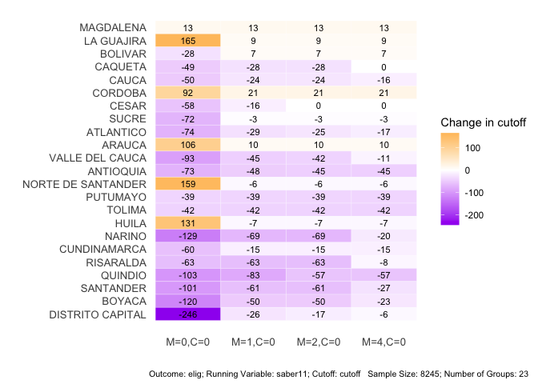
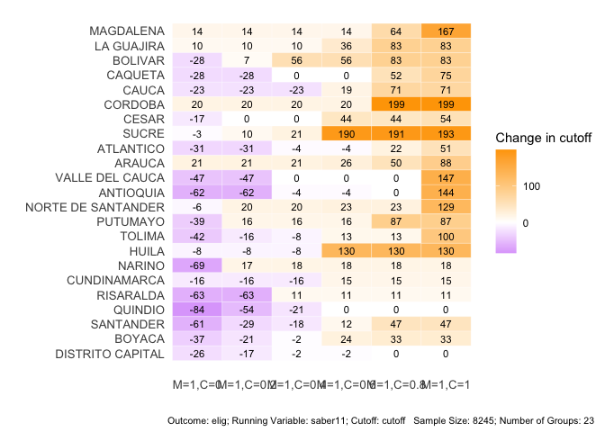

<!-- README.md is generated from README.Rmd. Please edit that file -->

# rdlearn

<!-- badges: start -->

<!-- badges: end -->

-   Author: Kentaro Kawato, Zhang Yi
-   Reference: Zhang Yi, Eli Ben-Michael, and Kosuke Imai. 2023. “Safe Policy Learning under Regression Discontinuity Designs with Multiple Cutoffs.” arXiv $$stat.ME$$.<http://arxiv.org/abs/2208.13323>.
-   Package manual: pdf file

## Installation Instructions

You can install the development version of rdleran from [GitHub](https://github.com/kkawato/rdlearn) with:

``` r
# install.packages("devtools")
devtools::install_github("kkawato/rdlearn")
```

## Example: Cutoff change relative to the baseline for each department (y-axis) under different smoothness multiplicative factors (x-axis)

``` r
## load pacakge
library(rdleran)
library(tidyverse)
library(nprobust)
library(nnet)
library(ggplot2)

## load example data
data('acces')

## set seed for replication
# set.seed(12345)

result <- rdlearn(y = "elig", x = "saber11", c = "cutoff", group_name = "department", data = acces, fold = 20, M = c(0, 1, 2, 4), cost = 0, trace = FALSE)

# use "plot" to visualize the result
# Figure 2
plot(result)
```



## Example: Cutoff change relative to the baseline for each department (y-axis) with varying cost of treatment (x-axis)

``` r
# "sens" is for sensitivity analysis.
# This function inherits the cross-fitting data.
sens_result <- sens(result, M = 1, cost=c(0, 0.2, 0.4, 0.6, 0.8, 1), trace = FALSE)
# Figure 3
plot(sens_result)
```


