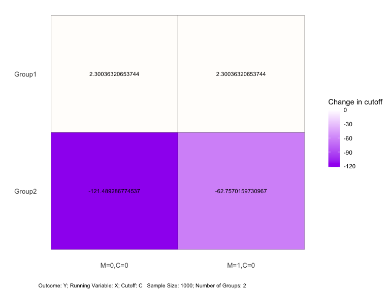
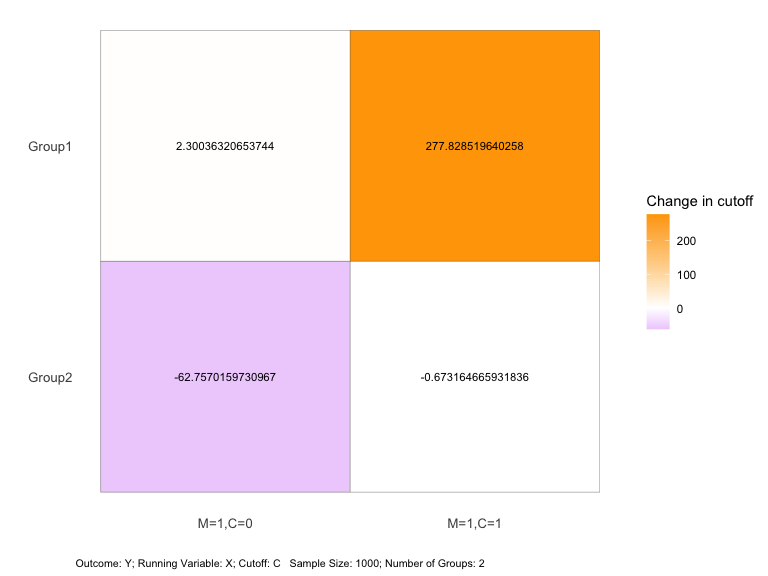

<!-- README.md is generated from README.Rmd. Please edit that file -->

# rdlearn

<!-- badges: start -->
<!-- badges: end -->

- Author: Kentaro Kawato, Zhang Yi
- Reference: Zhang Yi, Eli Ben-Michael, and Kosuke Imai. 2023. [“Safe
  Policy Learning under Regression Discontinuity Designs with Multiple
  Cutoffs.”](http://arxiv.org/abs/2208.13323) arXiv: 2208.13323.
- Package manual: pdf file

## Introduction

The R package `rdlearn` implements the *safe policy learning under
regression discontinuity designs with multiple cutoffs* of Zhang et
al.(2022). It provides functions to learn improved treatment assignment
rules (cutoffs) which are guaranteed to yield no worse overall outcomes
than the existing cutoffs.

This document demonstrates how to use the main functions of `rdlearn`.
For the replication of the empirical results of Zhang et al., please
refer to the vignette.

## Installation

The `rdlearn` package for R can be downloaded using (requires previous
installation of the [`remotes`
package](https://remotes.r-lib.org/index.html)).

Install the latest release from CRAN:

``` r
remotes::packages("rdlearn")
```

Install the development version from GitHub:

``` r
remotes::install_github("kkawato/rdlearn")
```

Load the package after the installation is complete.

``` r
library(rdlearn)
```

## Data

We can download the `acces` dataset and apply the proposed methodology
to the ACCES (Access with Quality to Higher Education) program, a
national-level subsidized loan initiative in Colombia.

The `acces` dataset includes four columns. The `elig` column contains
the *outcome* (eligibility for the ACCES program (1: eligible; 0: not
eligible). The `saber11` column contains *running variable* (position
scores from the SABER 11 exam). The `cutoff` column contains the
eligibility *cutoff* for each department, and the `department` column
contains the names of the departments.

``` r
library(rdlearn)

# Load acces data
data(acces)
head(acces)
#> # A tibble: 6 × 4
#>    elig saber11 cutoff department
#>   <dbl>   <dbl>  <dbl> <chr>     
#> 1     1      -2   -729 ANTIOQUIA 
#> 2     1      -5   -729 ANTIOQUIA 
#> 3     1     -11   -729 ANTIOQUIA 
#> 4     1     -12   -729 ANTIOQUIA 
#> 5     1     -14   -729 ANTIOQUIA 
#> 6     1     -15   -729 ANTIOQUIA
```

## Main Analysis: Cutoff change relative to the baseline for each department under different smoothness multiplicative factors

First, we demonstrate how to output *a summary of the dataset*, which
includes local treatment effect estimates at the baseline cutoffs (such
as Table 1 in Zhang et al.(2022)). This can be done as follows:

``` r
rdestimate_result <- rdestimate(
  y = "elig",
  x = "saber11",
  c = "cutoff",
  group_name = "department",
  data = acces
)
print(rdestimate_result)
#>                 Group Sample_size Baseline_cutoff RD_Estimate   se p_value
#> 1           MAGDALENA         214            -828        0.55 0.41   0.177
#> 2          LA GUAJIRA         209            -824        0.57 0.31   0.062
#> 3             BOLIVAR         646            -786        0.00 0.21   0.982
#> 4             CAQUETA         238            -779        0.56 0.35   0.107
#> 5               CAUCA         322            -774        0.02 0.78   0.977
#> 6             CORDOBA         500            -764       -0.63 0.26   0.014
#> 7               CESAR         211            -758        0.53 0.37   0.160
#> 8               SUCRE         469            -755        0.21 0.11   0.049
#> 9           ATLANTICO         448            -754        0.81 0.15   0.000
#> 10             ARAUCA         214            -753       -0.70 1.11   0.526
#> 11    VALLE DEL CAUCA         454            -732        0.61 0.16   0.000
#> 12          ANTIOQUIA         416            -729        0.70 0.21   0.001
#> 13 NORTE DE SANTANDER         233            -723       -0.08 0.43   0.858
#> 14           PUTUMAYO         236            -719       -0.47 0.79   0.556
#> 15             TOLIMA         347            -716        0.12 0.31   0.687
#> 16              HUILA         406            -695        0.06 0.23   0.797
#> 17             NARINO         463            -678        0.08 0.19   0.677
#> 18       CUNDINAMARCA         403            -676        0.12 0.81   0.882
#> 19          RISARALDA         263            -672        0.41 0.42   0.330
#> 20            QUINDIO         215            -660       -0.03 0.11   0.824
#> 21          SANTANDER         437            -632        0.74 0.25   0.003
#> 22             BOYACA         362            -618        0.48 0.36   0.187
#> 23   DISTRITO CAPITAL         539            -559        0.66 0.14   0.000
```

This provides basic information, including the sample size and baseline
cutoff for each group, as well as the RD treatment effect and standard
error. RD treatment effects marked with an asterisk (\*) are significant
at the 5% level.

Next, we show how to obtain the safe cutoffs by the proposed algorithm.
We use the simulation data B in the Appendix D of Zhang et al. (2022).
For the replication of the paper, please refer to the vignette.

Safe cutoffs can be learned as follows:

``` r
set.seed(1234)
data(simdata_B)
head(simdata_B)
#>           Y         X    C
#> 1 0.5820340 -218.9555 -571
#> 2 1.0034521 -775.4533 -571
#> 3 0.4432716 -139.2869 -571
#> 4 0.5288705 -613.2297 -571
#> 5 0.3053146 -124.8751 -571
#> 6 1.0728329 -410.1478 -571
```

``` r

rdlearn_result <- rdlearn(
  data = simdata_B,
  y = "Y",
  x = "X",
  c = "C",
  fold = 2,
  M = c(0, 1),
  cost = 0,
  trace = FALSE
)

summary(rdlearn_result)
#> 
#> ── Basic Information ───────────────────────────────────────────────────────────
#>    Group Sample_size Baseline_cutoff RD_Estimate   se p_value
#> 1 Group1         273            -850        0.17 0.13   0.188
#> 2 Group2         727            -571        0.14 0.09   0.108
#> 
#> ── Safe Cutoffs and Original Cutoff ────────────────────────────────────────────
#>        original   M=0,C=0   M=1,C=0
#> Group1     -850 -847.6996 -847.6996
#> Group2     -571 -780.9048 -633.7570
#> 
#> ── Numerical Difference of Cutoffs ─────────────────────────────────────────────
#>            M=0,C=0    M=1,C=0
#> Group1    2.300363   2.300363
#> Group2 -209.904807 -62.757016
#> 
#> ── Measures of Difference ──────────────────────────────────────────────────────
#>      M=0,C=0  M=1,C=0
#> l1  106.1026 32.52869
#> l2  148.4340 44.40571
#> max 209.9048 62.75702
```

``` r
plot(rdlearn_result, opt = "dif")
```



This plot shows the cutoff changes relative to the baseline for each
department under different smoothness multiplicative factors (`M`).

The main function here is `rdlearn`. The arguments include `data` for
the *dataset*, `y` for the column name of *outcome*, `x` for the column
name of *running variable*, `c` for the column name of *cutoff*, and
`group_name` for the column name of *group*. These arguments specify the
data we analyze. The `fold` argument specifies *the number of folds for
cross-fitting*.

For sensitivity analysis, the `M` argument specifies *the multiplicative
smoothness factor* and `cost` specifies *the treatment cost*.

For an `rdlearn_result` object obtained by `rdlearn`, we can use
`summary` to display the RD estimates, the obtained safe cutoffs, and
the differences between the safe and original cutoffs.

The `plot` function provides a clear visualization of the safe cutoffs.
Using `plot(result, opt = "safe")` shows *the obtained safe cutoffs*,
while `plot(result,opt = "dif")` shows *the differences between the safe
and original cutoffs*.

The `trace` argument can be set to `TRUE` to show progress during the
learning process.

## Sensitivity Analysis: Cutoff changes relative to the baseline for each department with varying treatment costs

Next, we implement another *sensitivity analysis*.

In the case of Zhang et al.(2022), we assume the utility function
$u(y, w) = y - C \times w$, where $y$ is a binary outcome (representing
the utility gain from enrollment), $C$ is a cost parameter ranging from
0 to 1, and $w$ is a binary treatment indicator (representing the
offering of a loan). To explore the trade-off between cost and utility,
we conduct a sensitivity analysis for the cost parameter: $C$.

We use the `sens` function with the `rdlearn_result` object as follows:

``` r
sens_result <- sens(
  rdlearn_result,
  M = 1,
  cost = c(0, 1),
  trace = FALSE)
plot(sens_result, opt = "dif")
```



This plot shows the cutoff change relative to the baseline for each
department under different values of `cost`.

If the learning process has already been implemented and the
`rdlearn_result` object is available, the `sens` function can be used to
modify parameters specifically for sensitivity analysis.

## References

Zhang, Y., Ben-Michael, E. and Imai, K. (2022) ‘Safe Policy Learning
under Regression Discontinuity Designs with Multiple Cutoffs’, arXiv
\[stat.ME\]. Available at: <http://arxiv.org/abs/2208.13323>.

Melguizo, T., F. Sanchez, and T. Velasco (2016). Credit for low-income
students and access to and academic performance in higher education in
Colombia: A regression discontinuity approach. World Development, 80,
61–77.
